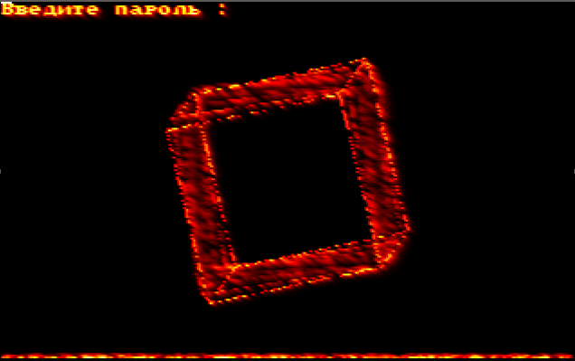

# 2001_DOS_3D_screen_saver
Rotating cube with flame effect - simple screensaver for MS-DOS

It was written for the MS-DOS platform in Borland Pascal 7.0. The graphics mode is VGA with a resolution of 320x200 and 256 colors.  Graphics are implemented by drawing on the buffer and then copying to the video memory. The edges of the cube are drawn using the Brezentham algorithm. The flame effect is achieved by drawing each point of the line with a random color, blurring and shifting the entire picture to the up.

*Read this in other languages: [English](README.md), [Русский](README.ru.md)

There are some screenshots:

# Table of contents
- [Installation](#Installation)
- [Control] (#Control)
- [Play in browser](#Play-in-browser)

# Installation

It is enough to download the box.zip file, unpack the archive and run box.exe, preferably in DosBox.

Or you can watch it in the browser using the js-dos emulator [Play in browser](#Play-in-browser). Unfortunately, in a browser emulator (unlike real hardware), the program works with poor performance.

To compile from sources (code folder), you must use the Borland Pascal 7.0 compiler

# Control

Key list:

1. Insert  - Select
2. Home  - Remove fire below
3. Page Up - Remove Blur Effect
4. Plus - Enlarge Cube
5. Minus - Reduce Cube
6. Cursor - Move

To exit, press 'Esc' and enter your password. By default, the password is empty. You can set a password by running PASSWORD.EXE. The password is stored in encrypted form in the PAROL.DAT file.

# Play in browser

Using the link below, you can try the game in the browser, through the js-dos emulator

[Play](https://andrey-andrianov.github.io/sites/jsdos/box2.html)

For more convenient control from mobile devices, the most frequently used keys have been added to the screen. They can be hidden or shown from the DosBox control panel on the left. Also, to run on mobile devices, it is convenient to add a web page to the home screen of the device.
